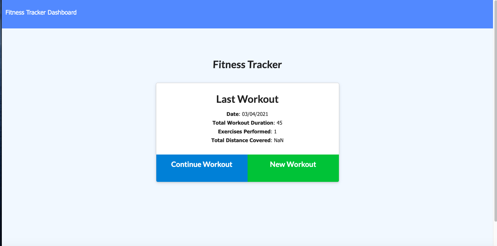
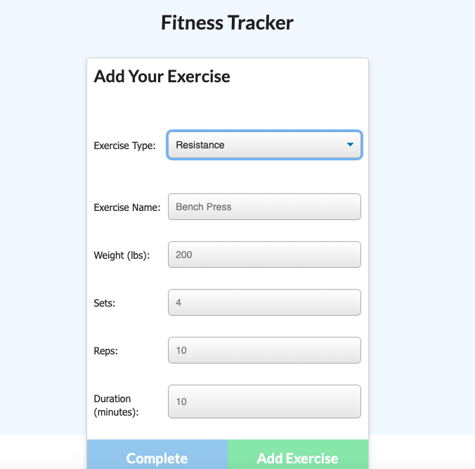
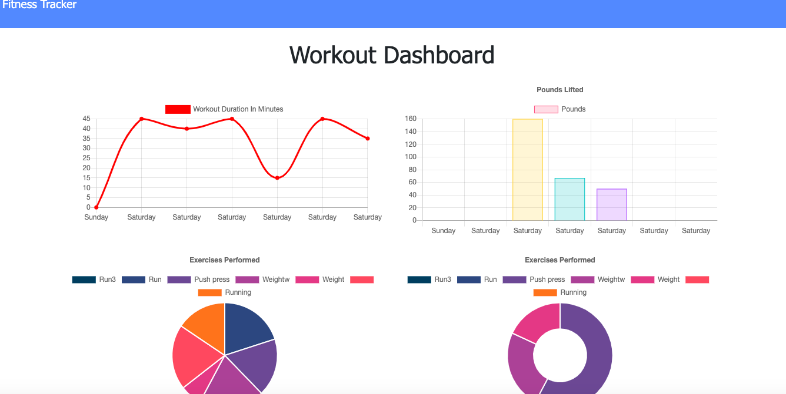

# Workout-Tracker
<h3>Week17-Homework</h3>

<!-- TABLE OF CONTENTS -->
<details open="open">
  <summary>Table of Contents</summary>
  <ol>
    <li>
      <a href="#about-the-project">About The Project</a>
    </li>
      <li><a href="#Technology">Technology</a></li>
       <li><a href="#getting-started">Getting Started</a></li>
    <li><a href="#license">License</a></li>
    <li><a href="#Learning">Learning</a></li>
    <li><a href="#contact">Contact</a></li>
  </ol>
</details>


<!-- ABOUT THE PROJECT -->
## About The Project
The user can keep tracking there daily workout history. 
They can keep track exercise name, type, weight if they used. set and raps. And duration time. The user can also check total duration from all the exercises.

## Technology

Major framework I used to create this application.

* [Node.js](https://nodejs.org/en/)
* [Express](https://expressjs.com/)
* [MongoDB](https://www.mongodb.com/)
* [Mongoose](https://mongoosejs.com/docs/)

## Getting Started

To use Fitness-Tracker locally, use http://localhost:8080 after completing the following steps:

```js
git clone github.com/Chib1co/Workout-Tracker
npm install
node server.js
```

## Learning

This assignment already provided front end code, thich means I had to go reverse engineering to figure out what I am missing from back end code. That was most difficult part for me to figure out what I need to put in the logic.

<!-- LICENSE -->
## License
[](https://opensource.org/licenses/MIT)

## Screenshot

* Home page


* Adding new exercise


* Recent 7 workout chart



<!-- CONTACT -->
## Contact

Tomomi Inoue 
</br>

Project Link: [https://github.com/Chib1co/Workout-Tracker](https://github.com/Chib1co/Workout-Tracker)

Deployed page: 


